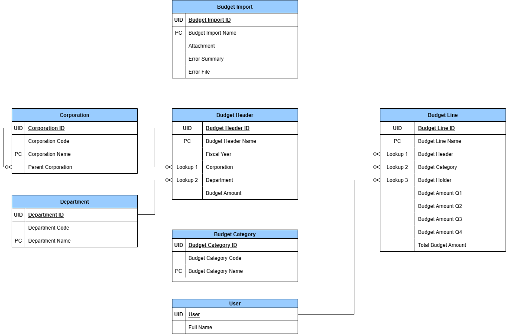
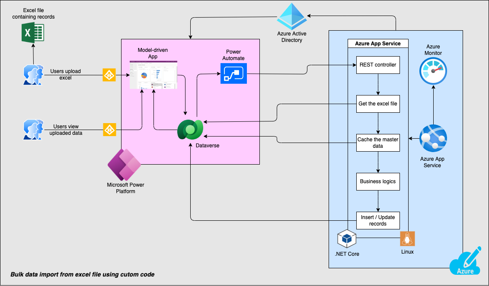

# Extend the capabilities of Power Platform using Azure Services for bulk data import from excel

## Introduction

Power Apps model-driven app provides out-of-the-box feature to import data from excel. However, there are scenarios where out-of-the-box excel import capabilities of model-driven app cannot meet the needs of complex business use cases such as:

* Run use case specific complex business validations
* Insert data into multiple tables from single excel
* Handle lookup dependencies while inserting into multiple tables
* Fine tuning for max throughput
* Ability to log and provide high observability

The sample addresses the above scenarios using a Power Platform model-driven app and a Power Automate flow to orchestrate bulk data import into Dataverse leveraging an Azure App Service which implements custom business logic. This sample contains an end-to-end implementation of bulk data import from excel for a Budget Management use case.

## Sample Business Challenge

Contoso is a multinational company that offers a wide range of products including food and beverage, home care, personal care, and beauty products. It has headquarters located in the United States and operates offices in multiple countries. Before beginning of a financial year (FY), finance team at Contoso head office prepares a global budget for the upcoming year and allocates the budget across different countries. Finance teams in each country then use the allocated budget to perform budget detailing for various departments in their organization using Excel files. The head office finance team consolidates the Excel files to review and approve the budget.

Budget management at Contoso is a very manual process. As the budget grows more complex, it can result in errors and inaccuracies that may negatively impact the company's financial health. The current process poses additional challenges such as inability to apply complex business logic, lack of a centralized view of budget across different countries and departments, lack of data security based on roles, limited collaboration, manual approval flow via emails etc.

To address these challenges, Contoso plans to automate the budget management process by leveraging Microsoft Power Platform and Azure.

### Proposed Solution

* Finance team in each country perform budget detailing in excel file.
* A Power Apps model-driven app is used as frontend for the finance team to upload excel.
* On upload of excel, a Power Automate flow is triggered that calls an Azure App Service.
* Azure App Service hosts APIs that run custom code to import data from excel, apply use-case specific business validations and insert data into Dataverse.
* Finance team views uploaded budget data on the model-driven app.
* If there are failures in importing data from excel, finance team can view error summary and download error report on the model-driven app.
* Budget data is available in the model-driven app for review and approval by the head office finance team.

### Sample ERD

## Architecture

Following diagram shows the architecture of the above mentioned scenario.

### Components

1. **Power Platform Model Driven App:** This is the user interface component of the solution. It contains the following entities:
    1. View to upload the Excel file containing the budget for the upcoming year.
    2. View to see the uploaded budget data.
1. **Microsoft Dataverse:** This is the data storage component of the solution, where the master data and the budget data is stored.
1. **Power Automate Flow:** This flow is triggered when a new record is created in the Excel Upload entity. This flow then calls the Azure App Service.
1. **Azure App Service:** This is the custom business logic component of the solution. It is implemented as a Web API written using .Net Core programming language. This component contains the following:
    1. Custom business validations
    1. Logic to insert data into multiple tables in Dataverse
1. **Azure Monitor:** This is used to monitor the Azure App Service.
1. **Azure Active Directory:** This is used to authenticate the Azure App Service with Dataverse.

## Solution Demo

https://user-images.githubusercontent.com/70320868/222704803-5b936650-c086-444e-83cf-6efc8638b80e.mp4

## Build and Test

This sample implementation contains the following components:

1. Power Platform Solution
1. Sample master data
1. Azure services provisioning script
1. Azure App Service code
1. Sample Excel files to test the solution

Follow the detailed steps in the [Build, Deploy and Test](./docs/build-deploy-and-test.md) document to build, deploy and test the implementation.

## Additional Information

* [Performance Tunning while inserting bulk data into Dataverse](./docs/performance-tunning.md)

## References

* [Microsoft Power Platform](https://powerplatform.microsoft.com/en-us/)
* [Microsoft Dataverse Web API](https://learn.microsoft.com/en-us/power-apps/developer/data-platform/webapi/overview)
* [Azure App Service](https://azure.microsoft.com/en-us/products/app-service/)
* [Azure Monitor](https://azure.microsoft.com/en-us/products/monitor/)
* [Azure Active Directory](https://azure.microsoft.com/en-us/products/active-directory/)
* [Microsoft Power Platform Model Driven Apps: Import data using Excel](https://learn.microsoft.com/en-us/power-apps/user/import-data)
